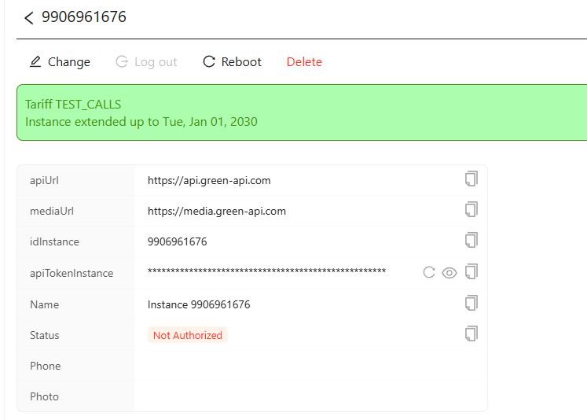

# Пошаговое руководство  

- [Step-by-step on English](./step-by-step.md)  

## Содержание  

* [Введение](#Введение)  
* [Бесплатные ресурсы, которые помогут вам лучше понять JavaScript](#Бесплатные-ресурсы-для-лучшего-понимания-JavaScript )  
* [Настройка среды браузера](#Настройка-среды-браузера)  
* [Настройка инстанса Green-API](#Настройка-инстанса-Green-API)  
* [Создание JS логики и интеграция голосовых вызовов с WhatsApp](#Создание-JS-логики-и-интеграция-голосовых-вызовов-с-WhatsApp)  
* [Заключение](#Заключение)  

## Введение  

Пошаговое руководство интиграции WhatsApp с библиотекой `whatsapp-api-calls-client-js` для совершения звонков. В этом руководстве вы узнаете:

* Как начать интеграцию голосовых вызовов с WhatsApp с чистого листа.
* И многое другое.

Рассмотрим также такие темы, как распространенные ошибки и способы их устранения, поддержание чистоты кода, настройка надлежащей среды разработки и другие важные аспекты. Звучит хорошо? Отлично! Давайте начнем.

## Бесплатные ресурсы, которые помогут вам лучше понять JavaScript

Создание интеграции голосовых вызовов интересная задача, но чтобы создать интеграцию с помощью `whatsapp-api-calls-client-js`, вам необходимо знать JavaScript. Для создания интеграции с минимальными знаниями JavaScript и программирования придётся не просто. Чтобы вам было проще справиться с трудонстями мы нашли для вас несолько ресурсов, которые помогут лучше узнать JavaScript:

* [Eloquent JavaScript](https://eloquentjavascript.net/), бесплатная онлайн-книга.
* [JavaScript.info](https://javascript.info/), современный учебник по JavaScript.
* [Codecademy](https://www.codecademy.com/learn/introduction-to-javascript), интерактивный курс JavaScript.
* [Nodeschool](http://nodeschool.io/), уроки по JavaScript и Node.js.
* [MDN Web Docs](https://developer.mozilla.org/en-US/docs/Web/JavaScript/Guide), руководство и полная документация по JavaScript.
* И, конечно же, не забывайте про Google — вашего друга для решения задач.

Выберите ресурс, изучите JavaScript, и как только почувствуете себя достаточно уверенно, вернитесь и начните создавать свое приложение.  

## Настройка среды браузера  

Прежде чем начать интеграцию голосовых вызовов WhatsApp, необходимо настроить правильную среду разработки. В этом разделе мы рассмотрим, как настроить простой веб-сервер с помощью Vite. Мы также рассмотрим, как использовать React с Vite в качестве альтернативной настройки.

**Примечание:** Если вы уже знакомы с настройкой среды разработки с использованием Vite или React, смело пропускайте этот раздел и переходите к следующему шагу.

### Настройка Vite без React  

Vite — это мощный инструмент сборки, который можно использовать не только с такими фреймворками, как React или Vue, но и для простых проектов без фреймворков. Он обеспечивает быстрое время сборки и плавный процесс разработки.  

#### Шаг 1: Установка Node.js

Сначала убедитесь, что Node.js установлен на вашем компьютере. Вы можете загрузить последнюю версию с [официального сайта Node.js](https://nodejs.org/). Node.js поставляется с npm (Node Package Manager), который вам понадобится для установки Vite.

#### Шаг 2: Создание базового проекта Vite  

Чтобы создать новый проект с Vite, откройте терминал и выполните следующие команды:  

```bash
npm create vite@latest my-simple-app
```

Когда будет предложено выбрать фреймворк, выберите «Vanilla» для проекта без front-end  фреймворка.

```bash
cd my-simple-app
npm install
```

Поздравляю вы создали новый проект Vite без фреймворков.

#### Шаг 3: Запуск сервера разработки

Теперь, когда ваш проект настроен, вы можете запустить сервер разработки:

```bash
npm run dev
```

Vite запустит локальный сервер разработки и предоставит URL (обычно `http://localhost:5173`), по которому вы сможете открыть свой веб-сайт в браузере.

#### Структура проекта

Структура вашего проекта будет выглядеть следующим образом:  

```
my-simple-app/
├── index.html
├── main.js
├── style.css
├── vite.config.js
└── package.json
```

- `index.html`: Основной HTML-файл вашего сайта.
- `main.js`: Основной файл JavaScript, в который вы можете добавлять свои собственные скрипты.
- `style.css`: CSS-файл, в котором вы можете писать свои собственные стили.
- `vite.config.js`: Конфигурационный файл для Vite.

#### Написание базового HTML и JavaScript

Отредактируйте `index.html` и `main.js`, чтобы создать свой сайт. Вот пример простого `index.html`:

```html
<!DOCTYPE html>
<html lang="en">
<head>
  <meta charset="UTF-8">
  <meta name="viewport" content="width=device-width, initial-scale=1.0">
  <title>My Простое приложение</title>
  <link rel="stylesheet" href="/style.css">
</head>
<body>
  <h1>Привет, Мир!</h1>
  <p>Простой проект без front-end фреймворка.</p>
  <script type="module" src="/main.js"></script>
</body>
</html>
```

Также заполним `main.js`:

```javascript
document.addEventListener('DOMContentLoaded', () => {
  console.log('JavaScript is working!');
});
```

Вы можете добавить свои стили в `style.css` и скрипты в `main.js` по мере необходимости.

#### Оптимизированная сборка сайта  

Как только вы будете готовы развернуть свой сайт, вы можете выполнить следующую команду:

```bash
npm run build
```

Это создаст папку `dist` создаст оптимизированную сборку вашего приложения, готовыми к развертыванию.

#### Узнайте больше о Vite

Для получения более подробной информации об использовании Vite без фреймворка ознакомьтесь со следующими ресурсами:

- [Официальная документация Vite](https://vitejs.dev/guide/)
- [Vite с Vanilla JS](https://vitejs.dev/guide/#scaffolding-your-first-vite-project)

---

### Настройка Vite с React  

Если вы предпочитаете использовать React для своего проекта, Vite также предоставляет для него отличную среду разработки.

##### Шаг 1: Создайте новый проект React с помощью Vite

Чтобы создать новый проект React с помощью Vite, откройте терминал и запустите:

```bash
npm create vite@latest my-react-app
```

При появлении запроса выберите «React», а затем выберите, хотите ли вы использовать JavaScript или TypeScript.

```bash
cd my-react-app
npm install
```

##### Шаг 2: Запустите сервер разработки

Как и в настройке Vite без фреймворка, вы можете запустить сервер разработки:

```bash
npm run dev
```

Это запустит сервер, и вы сможете просмотреть свое приложение React по адресу `http://localhost:5173`.

#### Структура проекта

Структура проекта React с Vite будет выглядеть следующим образом:

```
my-react-app/
├── src/
│ ├── assets/
│ ├── common/
│ ├── components/
│ ├── hooks/
│ ├── pages/
│ ├── router/
│ ├── services/
│ ├── store/
│ ├── styles/
│ ├── store/
│ ├── utils/
│ ├── voip/
│ ├── App.tsx
│ ├── main.tsx
│ └── index.css
├── index.html
├── package.json
├── tsconfig.json
├── vite.config.js
└── .gitignore
```

- index.html: файл HTML для начала сборки проекта Vite  
- package.json - нужен для сборки npm  
- tsconfig.json - нужен для использования typescript  
- vite.config.js - нужен для сборки html страниц проекта  
- public/index.html: Основной файл HTML  
- src/App.jsx: Основной компонент React  
- src/main.jsx: Точка входа приложения React  
- src/index.css: Файл CSS для стилизации  
- assets -- картинки проекта  
- common - всё что связано с типизацией и константами  
- components - папка с кастомными react-компонентами  
- hooks - кастомные хуки для react-компонентов  
- pages - компоненты-страницы (по сути компонент, состоящий из нескольких кастомный-компонентов, например страница main состоит из компонентов header, contact-list и т.д.)  
- services - содержит в себе конфигурацию Redux Toolkit для отправки запросов на сервер (например за списком контактов, получение статуса инстанса и т.д.)  
- store - конфигруация Redux Toolkit для работы с клиентским хранилищем  
- utils - вспомогательные функции для проекта (обработка ошибок, форматирование дат и т.д.)

#### Изменение компонента приложения  

Вы можете начать с изменения компонента `App.jsx`:

```jsx
import React from 'react';

function App() {
  return (
    <div className="App">
      <h1>Hello, React with Vite!</h1>
      <p>Start building your app here.</p>
    </div>
  );
}

export default App;
```

#### Оптимизированная сборка сайта  

Как только вы будете готовы развернуть свой сайт, вы можете выполнить следующую команду:

```bash
npm run build
```

Это создаст папку `dist` создаст оптимизированную сборку вашего приложения, готовыми к развертыванию.  

#### Узнайте больше о Vite с React  

Для получения более подробной информации об использовании Vite с React изучите эти ресурсы:

- [Официальный сайт React](https://reactjs.org/)
- [Документация Vite для React](https://vitejs.dev/guide/#scaffolding-your-first-vite-project)
- [React и Vite — Начало работы](https://reactjs.org/docs/create-a-new-react-app.html#create-react-app)

---

Выполнив эти шаги, вы можете построить простое веб-приложение без фреймворка с помощью Vite, либо более надежное приложение React. Оба подхода обеспечивают быструю и эффективную среду разработки, которая поможет вам создавать и развертывать ваши проекты.

### Настройка инстанса Green-API  

#### Создание вашего инстанса  

Теперь, когда вы настроили окружение для браузера и установили `whatsapp-api-calls-client.js`, вы почти готовы начать писать код! Следующий шаг — создать инстанс Green API на веб-сайте GreenAPI.

Выполните следующие шаги:

1. Откройте [личный кабинет GreenAPI](https://console.green-api.com/instanceList) и войдите в свою учетную запись.
2. Нажмите кнопку «Создать инстанс» и следуйте инструкциям.

#### Токен вашего инстанса

> **Внимание**
>
> Этот раздел критически важен, поэтому будьте внимательны. В нем объясняется, что такое токен вашего экземпляра, а также аспекты о его безопасности.

После создания пользователя бота вы увидите раздел вроде этого:

  

В этой панели вы можете изменить различные параметры инстанса, указать его имя, настроить web-hooks и т. д. Ваш токен инстанса будет отображаться при нажатии на значок «глаз», также вы можете просто скопировать его. Вам нужно ввести это значение, когда мы просим вас вставить ваш токен инстанса. Если вы случайно компрометируете свой токен инстанса, вам нужно будет вернуться на эту страницу и сбросить свой токен инстанса, после чего будет сгенерирован новый токен, который аннулирует все предыдущие.

#### Безопасность токенов

Крайне важно сохранить ваш токен инстанса в безопасности. Не закодируйте токен в своём коде и не делитесь им с другими людьми. Если ваш токен скомпрометирован, немедленно сбросьте его из консоли Green-API, чтобы предотвратить несанкционированный доступ.

#### Ограничения использования API  

Помните, что GreenAPI может налагать определенные ограничения на количество запросов, которые вы можете сделать в течение определенного периода времени. Превышение этих ограничений может привести к временной или постоянной приостановке вашего доступа к API. Всегда обращайтесь к официальной документации, чтобы понять эти ограничения.

## Создание JS логики и интеграция голосовых вызовов с WhatsApp  

В этом разделе мы проведем вас через процесс создания основного файла для интеграции голосовых вызовов WhatsApp с использованием класса `GreenApiVoipClient`. Main.js будет обрабатывать ключевые события, такие как входящие вызовы, принятие и отклонение вызовов и управление соединениями. К концу этого руководства у вас будет рабочий пример, который может управлять голосовыми вызовами WhatsApp.

#### Шаг 1: Настройка базовой структуры

Сначала создадим новый файл JavaScript `main.js` (или `main.ts`, если вы используете TypeScript), который будет служить точкой входа нашей интеграции.  

```javascript
import { GreenApiVoipClient } from '@green-api/whatsapp-api-calls-client-js';

// Инициализируем GreenApiVoipClient
const greenApiVoipClient = new GreenApiVoipClient();

// Пример параметров инициализации, замените на данные вашего инстанса
const initOptions = {
  idInstance: 'your-id-instance',
  apiTokenInstance: 'your-api-token-instance',
};

// Инициализируем клиент
greenApiVoipClient.init(initOptions).then(() => {
  console.log('GreenApiVoipClient инициализирован и подключен.');
}).catch(error => {
  console.error('Не удалось инициализировать GreenApiVoipClient:', error);
});
```

#### Шаг 2: Обработка основных событий

Класс `GreenApiVoipClient` это EventEmitter класс, который генерирует события, с помощью которыми можно управлять жизненным циклом вызова.

###### 1. **Событие входящего вызова**

При обнаружении входящего вызова запускается событие `INCOMING_CALL`. Это событие предоставляет `callId` и `wid` (идентификатор WhatsApp пользователя).

```javascript
greenApiVoipClient.addEventListener('INCOMING_CALL', (event) => {
  const { callId, wid } = event.detail.info;
  console.log('Входящий звонок от:', wid.user, 'Идентификатор звонка:', callId);
  
  //  Автоматически принять звонок (или показать пользовательский интерфейс пользователю)
  greenApiVoipClient.acceptCall().then(() => {
    console.log('Вызов принят.');
  }).catch(error => {
    console.error('Ошибка принятия звонка:', error);
  });
});
```

###### 2. **Событие готовности удаленного потока**

После того, как соединение успешно установлено и удаленный медиапоток готов, запускается событие `REMOTE_STREAM_READY`. Вы можете использовать это событие для начала воспроизведения удаленного аудиозвонка.

```javascript
greenApiVoipClient.addEventListener('REMOTE_STREAM_READY', (event) => {
  const remoteStream = event.detail;
  
  // Пример. Прикрепляем поток к аудиоэлементу для воспроизведения звука
  const audioElement = document.createElement('audio');
  audioElement.srcObject = remoteStream;
  audioElement.play();
  
  console.log('Удаленный поток готов и воспроизводится.');
});
```

###### 3. **Событие завершение вызова**

Событие `END_CALL` запускается при завершении вызова. Это может произойти по разным причинам, например, если удаленная сторона повесила трубку или истекло время ожидания.

```javascript
greenApiVoipClient.addEventListener('END_CALL', (event) => {
  const { type, payload } = event.detail;
  
  if (type === 'TIMEOUT') {
    console.log('Вызов завершен из-за тайм-аута.');
  } else if (type === 'REMOTE') {
    console.log('Вызов завершен удаленной стороной.');
  } else if (type === 'REJECTED') {
    console.log('Вызов отклонен.');
  } else if (type === 'SELF') {
    console.log('Вызов завершен пользователем.');
  }
  
  // Очистка пользовательского интерфейса или сброс состояния приложения
});
```

##### 4. **Событие обработка состояний вызовов**

Событие `CALL_STATE` предоставляет изменения в состоянии вызова, например, входящий звонок, подключение или соединение.

```javascript
greenApiVoipClient.addEventListener('CALL_STATE', (event) => {
  const { state } = event.detail;
  console.log('Состояние вызова изменено:', state);
  
  // Обновите свой пользовательский интерфейс на основе состояния, например, покажите "Входящий звонок...", когда состояние "входящий звонок"'
});
```

#### Шаг 3: Совершение исходящего вызова  

Чтобы инициировать исходящий вызов, используйте метод `startCall`.  

```javascript
const phoneNumber = 'recipient-phone-number';  // Заменить на номер телефона, который звоните

greenApiVoipClient.startCall(phoneNumber, true, false).then(() => {
  console.log('Вызов начат.');
}).catch(error => {
  console.error('шибка начала вызова:', error);
});

```

#### Шаг 4: Завершение или отклонение вызова

Чтобы завершить активный вызов, используйте метод `endCall`. Если вам нужно отклонить входящий вызов, используйте метод `rejectCall`.  

```javascript
// Завершение активного вызова  
greenApiVoipClient.endCall().then(success => {
  if (success) {
    console.log('Вызов успешно завершен.');
  } else {
    console.log('Не удалось завершить вызов.');
  }
}).catch(error => {
  console.error('Ошибка завершения вызова:', error);
});

// Отклонение входящего вызова
greenApiVoipClient.rejectCall().then(() => {
  console.log('Вызов отклонен.');
}).catch(error => {
  console.error('Ошибка отклонения вызова:', error);
});
```

### Заключение

В этом руководстве мы рассмотрели создание приложения для интеграции голосовых вызовов WhatsApp с использованием класса `GreenApiVoipClient`. Обрабатывая ключевые события, такие как входящие вызовы, удаленные потоки и состояния вызовов, вы можете эффективно управлять жизненным циклом вызовов WhatsApp в своем приложении.  

Обрабатывая ключевые события, такие как входящие вызовы, удаленные потоки и состояния вызовов, вы сможете эффективно управлять жизненным циклом вызовов WhatsApp в своем приложении. Этот руководство поможет вам в создании прочной основы для дальнейшей настройки приложения и интеграции дополнительных функций по мере необходимости.  

Усовершенствуйте наши примеры, добавляя элементы пользовательского интерфейса, обработку ошибок и любую другую пользовательскую логику, необходимую для создания вашего уникального сервиса.  
