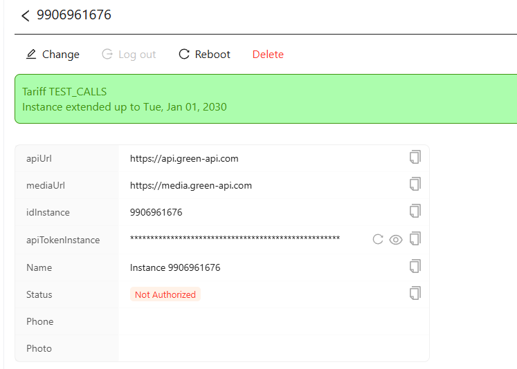

# Пошаговое руководство  

- [Step-by-step on English](./step-by-step.md)  

## Содержание  

* [Введение](#Введение)  
* [Бесплатные ресурсы, которые помогут вам лучше понять JavaScript](#Бесплатные-ресурсы-для-лучшего-понимания-JavaScript )  
* [Настройка среды браузера](#Настройка-среды-браузера)  
* [Настройка инстанса Green-API](#Настройка-инстанса-Green-API)  
* [Создание JS логики и интеграция голосовых вызовов с WhatsApp](#Создание-JS-логики-и-интеграция-голосовых-вызовов-с-WhatsApp)  
* [То же самое в React-клиенте](#то-же-самое-в-react-клиенте)  
* [Заключение](#Заключение)  

## Введение  

Пошаговое руководство интиграции WhatsApp с библиотекой `whatsapp-api-calls-client-js` для совершения звонков. В этом руководстве вы узнаете:

* Как начать интеграцию голосовых вызовов с WhatsApp с чистого листа.
* И многое другое.

Рассмотрим также такие темы, как распространенные ошибки и способы их устранения, поддержание чистоты кода, настройка надлежащей среды разработки и другие важные аспекты. Звучит хорошо? Отлично! Давайте начнем.

## Бесплатные ресурсы, которые помогут вам лучше понять JavaScript

Создание интеграции голосовых вызовов интересная задача, но чтобы создать интеграцию с помощью `whatsapp-api-calls-client-js`, вам необходимо знать JavaScript. Для создания интеграции с минимальными знаниями JavaScript и программирования придётся не просто. Чтобы вам было проще справиться с трудонстями мы нашли для вас несолько ресурсов, которые помогут лучше узнать JavaScript:

* [Eloquent JavaScript](https://eloquentjavascript.net/), бесплатная онлайн-книга.
* [JavaScript.info](https://javascript.info/), современный учебник по JavaScript.
* [Codecademy](https://www.codecademy.com/learn/introduction-to-javascript), интерактивный курс JavaScript.
* [Nodeschool](http://nodeschool.io/), уроки по JavaScript и Node.js.
* [MDN Web Docs](https://developer.mozilla.org/en-US/docs/Web/JavaScript/Guide), руководство и полная документация по JavaScript.
* И, конечно же, не забывайте про Google — вашего друга для решения задач.

Выберите ресурс, изучите JavaScript, и как только почувствуете себя достаточно уверенно, вернитесь и начните создавать свое приложение.  

## Настройка среды браузера  

Прежде чем начать интеграцию голосовых вызовов WhatsApp, необходимо настроить правильную среду разработки. В этом разделе мы рассмотрим, как настроить простой веб-сервер с помощью Vite. Мы также рассмотрим, как использовать React с Vite в качестве альтернативной настройки.

**Примечание:** Если вы уже знакомы с настройкой среды разработки с использованием Vite или React, смело пропускайте этот раздел и переходите к следующему шагу.

### Настройка Vite без React  

Vite — это мощный инструмент сборки, который можно использовать не только с такими фреймворками, как React или Vue, но и для простых проектов без фреймворков. Он обеспечивает быстрое время сборки и плавный процесс разработки.  

#### Шаг 1: Установка Node.js

Сначала убедитесь, что Node.js установлен на вашем компьютере. Вы можете загрузить последнюю версию с [официального сайта Node.js](https://nodejs.org/). Node.js поставляется с npm (Node Package Manager), который вам понадобится для установки Vite.

#### Шаг 2: Создание базового проекта Vite  

Чтобы создать новый проект с Vite, откройте терминал и выполните следующие команды:  

```bash
npm create vite@latest my-simple-app
```

Когда будет предложено выбрать фреймворк, выберите «Vanilla» для проекта без front-end  фреймворка.

```bash
cd my-simple-app
npm install
```

Поздравляю вы создали новый проект Vite без фреймворков.

#### Шаг 3: Запуск сервера разработки

Теперь, когда ваш проект настроен, вы можете запустить сервер разработки:

```bash
npm run dev
```

Vite запустит локальный сервер разработки и предоставит URL (обычно `http://localhost:5173`), по которому вы сможете открыть свой веб-сайт в браузере.

#### Структура проекта

Структура вашего проекта будет выглядеть следующим образом:  

```
my-simple-app/
├── index.html
├── main.js
├── style.css
├── vite.config.js
└── package.json
```

- `index.html`: Основной HTML-файл вашего сайта.
- `main.js`: Основной файл JavaScript, в который вы можете добавлять свои собственные скрипты.
- `style.css`: CSS-файл, в котором вы можете писать свои собственные стили.
- `vite.config.js`: Конфигурационный файл для Vite.

#### Написание базового HTML и JavaScript

Отредактируйте `index.html` и `main.js`, чтобы создать свой сайт. Вот пример простого `index.html`:

```html
<!DOCTYPE html>
<html lang="en">
<head>
  <meta charset="UTF-8">
  <meta name="viewport" content="width=device-width, initial-scale=1.0">
  <title>My Простое приложение</title>
  <link rel="stylesheet" href="/style.css">
</head>
<body>
  <h1>Привет, Мир!</h1>
  <p>Простой проект без front-end фреймворка.</p>
  <script type="module" src="/main.js"></script>
</body>
</html>
```

Также заполним `main.js`:

```javascript
document.addEventListener('DOMContentLoaded', () => {
  console.log('JavaScript is working!');
});
```

Вы можете добавить свои стили в `style.css` и скрипты в `main.js` по мере необходимости.

#### Оптимизированная сборка сайта  

Как только вы будете готовы развернуть свой сайт, вы можете выполнить следующую команду:

```bash
npm run build
```

Это создаст папку `dist` создаст оптимизированную сборку вашего приложения, готовыми к развертыванию.

#### Узнайте больше о Vite

Для получения более подробной информации об использовании Vite без фреймворка ознакомьтесь со следующими ресурсами:

- [Официальная документация Vite](https://vitejs.dev/guide/)
- [Vite с Vanilla JS](https://vitejs.dev/guide/#scaffolding-your-first-vite-project)

---

### Настройка Vite с React  

Если вы предпочитаете использовать React для своего проекта, Vite также предоставляет для него отличную среду разработки.

##### Шаг 1: Создайте новый проект React с помощью Vite

Чтобы создать новый проект React с помощью Vite, откройте терминал и запустите:

```bash
npm create vite@latest my-react-app
```

При появлении запроса выберите «React», а затем выберите, хотите ли вы использовать JavaScript или TypeScript.

```bash
cd my-react-app
npm install
```

##### Шаг 2: Запустите сервер разработки

Как и в настройке Vite без фреймворка, вы можете запустить сервер разработки:

```bash
npm run dev
```

Это запустит сервер, и вы сможете просмотреть свое приложение React по адресу `http://localhost:5173`.

#### Структура проекта

Структура проекта React с Vite будет выглядеть следующим образом:

```
my-react-app/
├── src/
│ ├── assets/
│ ├── common/
│ ├── components/
│ ├── hooks/
│ ├── pages/
│ ├── router/
│ ├── services/
│ ├── store/
│ ├── styles/
│ ├── store/
│ ├── utils/
│ ├── voip/
│ ├── App.tsx
│ ├── main.tsx
│ └── index.css
├── index.html
├── package.json
├── tsconfig.json
├── vite.config.js
└── .gitignore
```

- `index.html`: файл HTML для начала сборки проекта Vite  
- `package.json` - нужен для сборки npm  
- `tsconfig.json` - нужен для использования typescript  
- `vite.config.js` - нужен для сборки html страниц проекта  
- `public/index.html`: Основной файл HTML  
- `src/App.jsx`: Основной компонент React  
- `src/main.jsx`: Точка входа приложения React  
- `src/index.css`: Файл CSS для стилизации  
- `assets` -- картинки проекта  
- `common` - всё что связано с типизацией и константами  
- `components` - папка с кастомными react-компонентами  
- `hooks` - кастомные хуки для react-компонентов  
- `pages` - компоненты-страницы (по сути компонент, состоящий из нескольких кастомный-компонентов, например страница main состоит из компонентов header, contact-list и т.д.)  
- `services` - содержит в себе конфигурацию Redux Toolkit для отправки запросов на сервер (например за списком контактов, получение статуса инстанса и т.д.)  
- `store` - конфигруация Redux Toolkit для работы с клиентским хранилищем  
- `utils` - вспомогательные функции для проекта (обработка ошибок, форматирование дат и т.д.)

#### Изменение компонента приложения  

Вы можете начать с изменения компонента `App.jsx`:

```jsx
import React from 'react';

function App() {
  return (
    <div className="App">
      <h1>Hello, React with Vite!</h1>
      <p>Start building your app here.</p>
    </div>
  );
}

export default App;
```

#### Оптимизированная сборка сайта  

Как только вы будете готовы развернуть свой сайт, вы можете выполнить следующую команду:

```bash
npm run build
```

Это создаст папку `dist` создаст оптимизированную сборку вашего приложения, готовыми к развертыванию.  

#### Узнайте больше о Vite с React  

Для получения более подробной информации об использовании Vite с React изучите эти ресурсы:

- [Официальный сайт React](https://reactjs.org/)
- [Документация Vite для React](https://vitejs.dev/guide/#scaffolding-your-first-vite-project)
- [React и Vite — Начало работы](https://reactjs.org/docs/create-a-new-react-app.html#create-react-app)

---

Выполнив эти шаги, вы можете построить простое веб-приложение без фреймворка с помощью Vite, либо более надежное приложение React. Оба подхода обеспечивают быструю и эффективную среду разработки, которая поможет вам создавать и развертывать ваши проекты.

### Настройка инстанса Green-API  

#### Создание вашего инстанса  

Теперь, когда вы настроили окружение для браузера и установили `whatsapp-api-calls-client.js`, вы почти готовы начать писать код! Следующий шаг — создать инстанс Green API на веб-сайте GreenAPI.

Выполните следующие шаги:

1. Откройте [личный кабинет GreenAPI](https://console.green-api.com/instanceList) и войдите в свою учетную запись.
2. Нажмите кнопку «Создать инстанс» и следуйте инструкциям.

#### Токен вашего инстанса

> **Внимание**
>
> Этот раздел критически важен, поэтому будьте внимательны. В нем объясняется, что такое токен вашего экземпляра, а также аспекты о его безопасности.

После создания пользователя бота вы увидите раздел вроде этого:

  

В этой панели вы можете изменить различные параметры инстанса, указать его имя, настроить web-hooks и т. д. Ваш токен инстанса будет отображаться при нажатии на значок «глаз», также вы можете просто скопировать его. Вам нужно ввести это значение, когда мы просим вас вставить ваш токен инстанса. Если вы случайно компрометируете свой токен инстанса, вам нужно будет вернуться на эту страницу и сбросить свой токен инстанса, после чего будет сгенерирован новый токен, который аннулирует все предыдущие.

#### Безопасность токенов

Крайне важно сохранить ваш токен инстанса в безопасности. Не закодируйте токен в своём коде и не делитесь им с другими людьми. Если ваш токен скомпрометирован, немедленно сбросьте его из консоли Green-API, чтобы предотвратить несанкционированный доступ.

#### Ограничения использования API  

Помните, что GreenAPI может налагать определенные ограничения на количество запросов, которые вы можете сделать в течение определенного периода времени. Превышение этих ограничений может привести к временной или постоянной приостановке вашего доступа к API. Всегда обращайтесь к официальной документации, чтобы понять эти ограничения.

## Создание JS логики и интеграция голосовых вызовов с WhatsApp  

В этом разделе мы проведем вас через процесс создания основного файла для интеграции голосовых вызовов WhatsApp. Библиотека состоит из двух частей: `GreenApiVoipClient` оборачивает REST-методы (набор номера, принятие, отклонение, завершение), а `CallsConnection` — создаётся методом `connectCalls()` — держит WebSocket к серверу, сообщает состояние звонка и несёт WebRTC-аудио. К концу этого руководства у вас будет рабочий пример, который может управлять голосовыми вызовами WhatsApp.

#### Шаг 1: Настройка базовой структуры

Сначала создадим новый файл JavaScript `main.js` (или `main.ts`, если вы используете TypeScript), который будет служить точкой входа нашей интеграции.  

```javascript
import { GreenApiVoipClient } from '@green-api/whatsapp-api-calls-client-js';

// Замените на данные вашего инстанса
const client = new GreenApiVoipClient({
  idInstance: 'your-id-instance',
  apiTokenInstance: 'your-api-token-instance',
  apiUrl: 'your-api-url', // хост API вашего инстанса, например https://1234.api.green-api.com
});

// Открываем соединение для звонков: оно переподключается само, а сервер
// присылает текущее состояние звонка сразу после подключения и при каждом изменении.
const calls = client.connectCalls();

calls.addEventListener('connect', () => console.log('Соединение для звонков установлено.'));
calls.addEventListener('disconnect', (event) => console.log('Соединение потеряно:', event.detail.reason));
calls.addEventListener('error', (event) => console.error('Ошибка звонков:', event.detail.message));
```

Инстанс должен быть уже авторизован (QR-код отсканирован в консоли) — библиотека занимается только звонками.

#### Шаг 2: Обработка основных событий

`CallsConnection` — это `EventTarget`, который генерирует события, с помощью которых можно управлять жизненным циклом вызова.

###### 1. **Состояние вызова**

Событие `state` запускается при каждом изменении состояния. `event.detail.state` — одно из `idle`, `inc-call`, `out-call`, `on-call`; для состояний звонка `event.detail.info` описывает вызов (`id`, `wid`, `name`). Стройте интерфейс от него — то же событие приходит сразу после (пере)подключения, поэтому страница, перезагруженная посреди звонка, сразу покажет верное состояние.

```javascript
calls.addEventListener('state', (event) => {
  const { state, info } = event.detail;
  console.log('Состояние вызова:', state, info ?? '');

  // например, показать «Звоним...» для 'out-call', кнопки принять/отклонить для 'inc-call'
});
```

###### 2. **Событие входящего вызова**

При входящем вызове один раз запускается событие `incoming-call` с информацией о звонке: `id`, `wid` (идентификатор WhatsApp звонящего) и `name`. Принятие — это REST-вызов, а аудиомост поднимается после него — именно в таком порядке (почему — см. шаг 3).

```javascript
calls.addEventListener('incoming-call', async (event) => {
  const { id, wid, name } = event.detail;
  console.log('Входящий звонок от:', name || wid, 'Идентификатор звонка:', id);

  // Автоматически принять звонок (или показать пользовательский интерфейс пользователю)
  try {
    await client.accept();
    await calls.startAudioBridge();
    console.log('Вызов принят.');
  } catch (error) {
    console.error('Ошибка принятия звонка:', error);
  }
});
```

###### 3. **Событие готовности удаленного потока**

После того как WebRTC-соединение установлено и удалённый медиапоток готов, запускается событие `remote-stream-ready`. Используйте его, чтобы начать воспроизведение звука собеседника. (Раньше него приходит `local-stream-ready` с потоком вашего микрофона — пригодится, если хотите показать индикатор уровня.)

```javascript
calls.addEventListener('remote-stream-ready', (event) => {
  const remoteStream = event.detail;

  // Пример. Прикрепляем поток к аудиоэлементу для воспроизведения звука
  const audioElement = document.createElement('audio');
  audioElement.srcObject = remoteStream;
  audioElement.play();

  console.log('Удаленный поток готов и воспроизводится.');
});
```

###### 4. **Событие завершения вызова**

Событие `end-call` запускается, когда шедший звонок закончился. `event.detail.reason` говорит, чьё это было решение:

* `call-ended` — звонок завершил сервер: собеседник положил трубку, истёк таймаут, вызов приняли на другом устройстве и т. п.;
* `connection-lost` — во время звонка оборвался наш WebSocket, и восстановить его не удалось.

Для `call-ended` в detail может быть ещё `cause` — слово сервера о том, что произошло, как есть. Известные значения: `hangup`, `timeout`, `accepted_elsewhere` (вызов приняли на другом устройстве того же аккаунта, например на телефоне), `rejected_elsewhere`, `no-media`, `connect-timeout`, `instance-gone`, `rejected:<причина>`. Словарь открытый: незнакомое слово показывайте как есть, а не отбрасывайте. `cause` отсутствует, если сервер причину не назвал, и всегда отсутствует при `connection-lost`.

```javascript
calls.addEventListener('end-call', (event) => {
  const { reason, cause } = event.detail;

  if (reason === 'connection-lost') {
    console.log('Вызов завершён: потеряно соединение с сервером.');
  } else if (cause === 'accepted_elsewhere') {
    console.log('Вызов принят на другом устройстве.');
  } else if (cause === 'timeout') {
    console.log('Вызов завершён из-за тайм-аута.');
  } else {
    console.log('Вызов завершён.', cause ? `Причина: ${cause}` : '');
  }

  // Очистка пользовательского интерфейса или сброс состояния приложения
});
```

Аудиомост при завершении звонка библиотека разбирает сама — вызывать `stopAudioBridge()` здесь не нужно.

#### Шаг 3: Совершение исходящего вызова  

Чтобы инициировать исходящий вызов, используйте `dial` с номером телефона (или полным `chatId` вида `79991234567@c.us`), а затем поднимите аудиомост.

```javascript
const phoneNumber = '79991234567'; // Заменить на номер телефона, которому звоните

try {
  await client.dial(phoneNumber);
  await calls.startAudioBridge();
  console.log('Вызов начат.');
} catch (error) {
  console.error('Ошибка начала вызова:', error);
}
```

Порядок важен: браузерное аудиоплечо на сервере принадлежит звонку, поэтому offer без звонка сервер отвергает (`no active call`), а `startAudioBridge()` завершается только когда сервер ответил. Упавший мост звонок не отменяет — сервер его держит, и `startAudioBridge()` можно вызвать ещё раз (так же подключают звук после перезагрузки страницы: если `calls.state.state` — `out-call`/`on-call`, а `calls.hasAudioBridge` — `false`, просто поднимите мост, без нового `dial`/`accept`).

#### Шаг 4: Завершение или отклонение вызова

Чтобы завершить активный вызов, используйте `hangUp`. Чтобы отклонить входящий — `reject`. Оба — REST-вызовы; состояние `idle` и событие `end-call` придут по соединению.

```javascript
// Завершение активного вызова
try {
  await client.hangUp();
  console.log('Вызов успешно завершен.');
} catch (error) {
  console.error('Ошибка завершения вызова:', error);
}

// Отклонение входящего вызова
try {
  await client.reject();
  console.log('Вызов отклонен.');
} catch (error) {
  console.error('Ошибка отклонения вызова:', error);
}
```

Когда звонки больше не нужны, `calls.close()` остановит мост и закроет WebSocket. `client.getCallState()` возвращает текущее состояние по REST, если оно понадобилось вне соединения.

## То же самое в React-клиенте

Всё описанное выше — это несколько слушателей на одной странице. В настоящем приложении
страниц больше одной, и тут начинают значить те места, которые выглядели мелочами.
React-клиент в [`examples/react`](../examples/react/) — как раз такое приложение, и читать
дальше стоит именно его.

### Один клиент на всё приложение

Библиотека принимает учётные данные в конструкторе, поэтому клиент не может существовать до
входа пользователя, а перерисовка не должна стоить второго сокета. В примере и клиент, и
соединение живут в [`src/voip/index.ts`](../examples/react/src/voip/index.ts), вне дерева
компонентов: открытие идемпотентно, а компоненты подписываются на соединение, а не создают
его.

### Что уже произошло к моменту монтирования компонента

Сначала дожидаются `dial()` или `accept()`, затем `startAudioBridge()`, и только потом
приложение переходит на экран звонка. То есть к моменту появления аудиоэлементов события
`local-stream-ready` и `remote-stream-ready` уже отработали. Компонент, который только
подписывается на них, не услышит ничего — события прошли.

Поэтому модуль запоминает последние потоки и отдаёт их тому, кто спросит
(`getMediaStreams()`), а [`src/hooks/useVoip.ts`](../examples/react/src/hooks/useVoip.ts)
связывает обе стороны: поток, пришедший для уже отрисованного элемента, подключается сразу, а
элемент, смонтированный позже, забирает поток, которого ждал. То же и со статусом связи —
подписка после уже случившегося `connect` оставила бы приложение с надписью «нет связи» при
полностью живом соединении.

### Отключение микрофона

Мьюта в библиотеке нет, и он не нужен. Трек, который она отдаёт в `local-stream-ready`, — тот
самый, что добавлен в peer connection, поэтому его отключение и есть то, что перестаёт слышать
собеседник:

```javascript
stream.getAudioTracks().forEach((track) => { track.enabled = false; });
```

Две вещи надо сделать правильно, обе — в
[`src/voip/index.ts`](../examples/react/src/voip/index.ts):

* **Переподключение заменяет микрофон.** Если сокет оборвался при поднятом мосте, библиотека
  разбирает мост, дожидается сокета и поднимает его заново — новый `getUserMedia`, новый трек
  и никакого `end-call` между ними, потому что звонок не завершался. Новый трек приходит
  включённым. Перенесите мьют на него, иначе микрофон тихо оживёт, а кнопка продолжит
  показывать «выключен».
* **Остановленный трек — не микрофон.** Треки, остановленные при разборе моста, остаются в
  потоке, поэтому посчитать их — не то же самое, что иметь микрофон. Проверяйте
  `track.readyState === 'live'`, прежде чем сообщать, что мьют подействовал.

### Как показать, кто звонит

Звонок несёт `wid` — `79991234567@c.us` для номера телефона либо `1062110180230@lid` для
собеседника, чьего номера у вас нет. Поле `info.name` заполнено, только если у WhatsApp есть
pushname, а для лида его обычно нет.

`getContacts` возвращает оба адреса одного человека (`id` и `lid`), поэтому контакт находится
по любому из них — так [`src/pages/call.tsx`](../examples/react/src/pages/call.tsx) и
подставляет имя звонящему, приехавшему голыми цифрами. Сама модель адреса — в
[`src/common/address.ts`](../examples/react/src/common/address.ts): номер и лид это
альтернативы, набирается ровно один из них, а номер разбирается относительно своей страны, а
не склеивается с кодом — иначе межгородская восьмёрка или британский `0` уедут в набираемый
адрес, и звонок уйдёт другому человеку.

### Заключение

В этом руководстве мы рассмотрели создание приложения для интеграции голосовых вызовов WhatsApp с использованием `GreenApiVoipClient` и `CallsConnection`. Обрабатывая ключевые события — входящие вызовы, удалённые потоки, состояния вызова и его завершение с причиной, — вы сможете эффективно управлять жизненным циклом вызовов WhatsApp в своём приложении. Это руководство поможет вам в создании прочной основы для дальнейшей настройки приложения и интеграции дополнительных функций по мере необходимости.  

